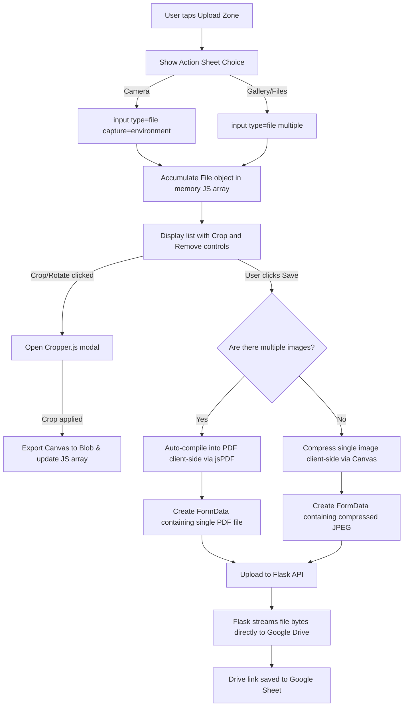

# Nammane Developer Documentation

This document describes the technical architecture, database schemas, authentication flows, and frontend/backend integration details of the **Nammane** (Our Home) personal manager web application. It serves as a guide for developers to understand the project structure or rebuild it from scratch.

---

## 1. Tech Stack Overview

The application is designed to be lightweight and run on low-resource environments (e.g., a 1GB RAM server) by offloading heavy computational tasks (like image processing, cropping, and PDF rendering) entirely to the client's browser.

### Backend (Python/Flask)
- **Framework:** Flask (Python 3)
- **Routing & Proxying:** Flask routes for handling data API requests, serving the single-page application (SPA), and proxying files securely.
- **Authentication & Rate Limiting:** Custom IP-based rate limiter and lockout mechanism to prevent brute-force entry attempts.
- **Google Services Integration:** Integrates `google-api-python-client` to interact with Google Sheets (acting as a relational database) and Google Drive (for document/media storage).

### Database & Storage (Google Workspace)
- **Relational Data:** Stored in a single **Google Sheet** containing multiple tabs (worksheets) acting as database tables.
- **File Storage:** Stored in **Google Drive** inside organized folders (e.g., `MedicalReports/[Person_Name]/[Entry_Name]/`, `Insurance/[Provider]_[Policy_Name]/`, etc.).

### Frontend (HTML5 / Vanilla CSS / Vanilla JS / SPA)
- **Structure:** Single Page Application (SPA) served from `templates/index.html`.
- **Styling:** Custom CSS built on top of Bootstrap 5 CSS grid and utilities, styled with custom color palettes (Forest Green `#1a3a2a`, warm beiges, and orange accent `#c8873a`). Icons are rendered using Bootstrap Icons.
- **Libraries (CDN loaded):**
  - **Cropper.js:** Client-side image crop and 90-degree rotation.
  - **jsPDF:** Client-side compiler to combine multiple images into a single `.pdf` document.

---

## 2. Environment Variables & Credentials

The backend configures itself using a `.env` file located in the project root:

```ini
# Application configuration
READ_PIN=1111      # PIN code for read-only access
WRITE_PIN=2222     # PIN code for full read/write/delete access

# Execution mode: 'mock' (local testing) or 'google' (production)
EXECUTION_MODE=google

# Google APIs (Required if EXECUTION_MODE=google)
SPREADSHEET_ID=your_google_spreadsheet_id_here
DRIVE_ROOT_FOLDER_ID=your_google_drive_folder_id_here
```

### Google OAuth Credentials
To communicate with Google APIs, the app expects:
1. `credentials.json`: Client secrets downloaded from the Google Cloud Console (configured with the Google Sheets API and Google Drive API scopes).
2. `token.json`: Generated dynamically on first startup via the OAuth2 flow and persisted to save the access and refresh tokens.

---

## 3. Database Schema (Google Sheets)

The database is built on a single spreadsheet. Running `python3 init_gsheets.py` will automatically create the worksheets and insert column headers if they do not exist.

### Table: `People`
Stores family members and profiles.
- `id` (string, UUID)
- `name` (string)
- `dob` (date, `YYYY-MM-DD`)
- `relation` (string)
- `blood_group` (string)
- `allergies` (string)
- `description` (text)
- `created_at` (ISO timestamp)
- `is_deleted` (boolean flag: `TRUE` / `FALSE`)

### Table: `Health_Entries`
Stores medical reports and doctor visits.
- `id` (string, UUID)
- `person_id` (foreign key linking to `People.id`)
- `name` (string, e.g. "Annual Health Checkup")
- `doctor` (string)
- `hospital` (string)
- `date` (date, `YYYY-MM-DD`)
- `next_visit_date` (date)
- `description` (text)
- `linked_entry_id` (foreign key linking to another `Health_Entries.id`)
- `created_at` (ISO timestamp)
- `is_deleted` (boolean flag)

### Table: `Health_Attachments`
Individual files/observations linked to a `Health_Entries` report.
- `id` (string, UUID)
- `entry_id` (foreign key linking to `Health_Entries.id`)
- `name` (string, e.g. "Blood Sugar Report")
- `file_path` (string, Google Drive URL link)
- `file_drive_link` (string, Google Drive URL link)
- `value` (string, optional measurement, e.g. "120/80 mmHg")
- `datetime` (date-time string)
- `description` (text)
- `created_at` (ISO timestamp)
- `is_deleted` (boolean flag)

### Table: `Health_Medicines`
Prescribed medicines linked to a medical visit or family member.
- `id` (string, UUID)
- `person_id` (foreign key linking to `People.id`)
- `entry_id` (foreign key linking to `Health_Entries.id`)
- `medicine_name` (string)
- `purpose` (string)
- `dosage` (string, e.g. "500mg")
- `when_to_take` (string comma-separated, e.g. "Morning,After food")
- `from_date` (date)
- `until_date` (date)
- `ongoing` (boolean flag: `TRUE` / `FALSE`)
- `notes` (text)
- `created_at` (ISO timestamp)
- `is_deleted` (boolean flag)

### Table: `Health_Insurance`
Stores insurance policy records and documents.
- `id` (string, UUID)
- `persons_covered` (string comma-separated keys linking to `People.id`)
- `provider` (string)
- `policy_name` (string)
- `policy_number` (string)
- `type` (string, e.g. "Health", "Life", "Vehicle")
- `sum_insured` (number)
- `premium_amount` (number)
- `premium_frequency` (string, e.g. "Annual", "Monthly")
- `premium_due_date` (date)
- `renewal_date` (date)
- `file_paths` (string comma-separated Google Drive links)
- `file_drive_links` (string comma-separated Google Drive links)
- `notes` (text)
- `created_at` (ISO timestamp)
- `is_deleted` (boolean flag)

### Table: `Vault_Documents`
Personal identity, property, or legal document tracker.
- `id` (string, UUID)
- `person_id` (foreign key linking to `People.id` or empty for "Family/All")
- `category` (string, e.g. "Identity", "Property", "Vehicle")
- `name` (string, e.g. "Aadhar card")
- `document_number` (string)
- `issued_by` (string)
- `issue_date` (date)
- `expiry_date` (date)
- `file_paths` (string comma-separated Google Drive links)
- `file_drive_links` (string comma-separated Google Drive links)
- `description` (text)
- `created_at` (ISO timestamp)
- `is_deleted` (boolean flag)

### Table: `Warranty_Cards`
Stores purchased appliances and products warranties.
- `id` (string, UUID)
- `product` (string, e.g. "Samsung Refrigerator")
- `purchase_date` (date)
- `warranty_till` (date)
- `file_paths` (string comma-separated Google Drive links)
- `file_drive_links` (string comma-separated Google Drive links)
- `notes` (text)
- `created_at` (ISO timestamp)
- `is_deleted` (boolean flag)

---

## 4. Key Security & Control Flows

### 4.1 Authentication & IP Lockout
1. **Access Authorization:** When requesting APIs, the client sends the entered PIN in the `X-Access-Pin` request header. 
2. **Access Control Decorator (`@login_required`):**
   - Intercepts requests. Reads client IP.
   - If the IP has had $\ge 5$ invalid attempts, it locks the IP for **12 hours** (returns status `429 Too Many Requests`).
   - Validates that the PIN matches `WRITE_PIN` for mutations (`POST`, `PUT`, `DELETE`) or `READ_PIN`/`WRITE_PIN` for `GET` requests.
3. **Login Endpoint (`/api/login`):** Validates the PIN and returns a JSON payload stating the access role (`read` or `write`).

### 4.2 Document View Proxying (`/api/drive/proxy`)
Because Google Drive links are not publicly accessible and require authentication:
1. When viewing a document on the frontend, links are routed through `/api/drive/proxy?pin=...&link=...`.
2. The backend validates the `pin` argument (applying the lockout rate limits).
3. If authorized, the backend extracts the `file_id` from the Google Drive `webViewLink` and calls the Drive API's `get_media()` method to fetch raw bytes.
4. It streams the raw file bytes back to the browser with the original MIME type (e.g. `application/pdf`, `image/jpeg`).

---

## 5. File Upload & Processing Flow

To keep the Flask server's memory consumption low and prevent Out-Of-Memory (OOM) crashes on 1GB RAM instances, file compilation and modifications happen client-side.



### 5.1 Mobile Camera Integration
- Mobile browsers (iOS Safari, Android Chrome) trigger the native camera interface directly when an `<input type="file" accept="image/*" capture="environment">` is clicked.
- **Privacy Aspect:** On iOS Safari, images captured through this input are placed directly into the browser session sandbox as temporary uploads and **do not** save to the user's iPhone Photos library.

### 5.2 Client-Side Cropping (Cropper.js)
- Images loaded from inputs are read into memory using a `FileReader` as a Data URL.
- `Cropper.js` is initialized inside an overlay modal `#cropper-modal` to provide image cropping.
- **Rotation:** Images taken on mobile devices are often rotated incorrectly. Buttons in the modal trigger `cropper.rotate(90)` or `-90` to fix this.
- Clicking "Apply" outputs a cropped HTML5 Canvas. We export this canvas back into a raw File object:
  ```javascript
  canvas.toBlob((blob) => {
    const croppedFile = new File([blob], filename, { type: 'image/jpeg' });
    // Replace original file in array
  }, 'image/jpeg', 0.92);
  ```

### 5.3 High-Quality Compression (Target ~2MB)
- Raw photos from modern smartphones are often 10MB+. Uploading multiple uncompressed photos consumes high mobile data and overflows Google Drive limits.
- Before compilation or upload, images are processed in a canvas:
  - Scaled proportionally so that the maximum dimension (width or height) is **2560px** (preserves crisp, fine print on invoices).
  - Exported as JPEG with **0.92** quality.
  - This results in files averaging **1.5MB to 2.5MB** that look identical to the original image but upload much faster.

### 5.4 Automatic PDF Compilation (jsPDF)
- If a user uploads **2 or more images** in a form, they are automatically merged into a single multi-page PDF.
- The client-side logic processes the images sequentially, adds a new page in `jsPDF` for each image, scales each image to fit A4 page dimensions while keeping its aspect ratio, and exports the PDF:
  ```javascript
  const pdfBlob = pdf.output('blob');
  const compiledPdfFile = new File([pdfBlob], name, { type: 'application/pdf' });
  ```
- The compiled `.pdf` file replaces the individual images inside the FormData object before the fetch request is dispatched to the backend API.

---

## 6. How to Rebuild & Run the Project

### Step 1: Install Requirements
Ensure Python 3 is installed, then install the dependencies from `requirements.txt`:
```bash
pip install -r requirements.txt
```

### Step 2: Configure Environment
Copy `.env.example` to `.env` and fill in the values:
- Set your target `READ_PIN` and `WRITE_PIN`.
- Place your `credentials.json` file (Service Account or OAuth Client Credentials) in the root directory.
- Specify the `SPREADSHEET_ID` and `DRIVE_ROOT_FOLDER_ID`.

### Step 3: Initialize Google Sheet
Run the initialization script to configure the worksheets and headers:
```bash
python3 init_gsheets.py
```

### Step 4: Run the Server
Launch the Flask development server:
```bash
python3 app.py
```
By default, the application serves on port `5001`. You can access it on `http://127.0.0.1:5001`.
